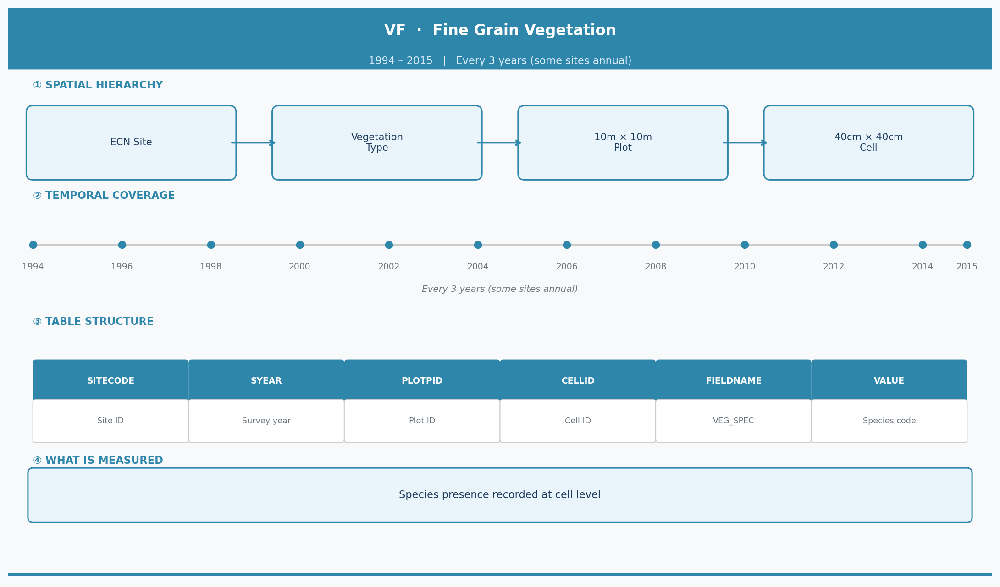
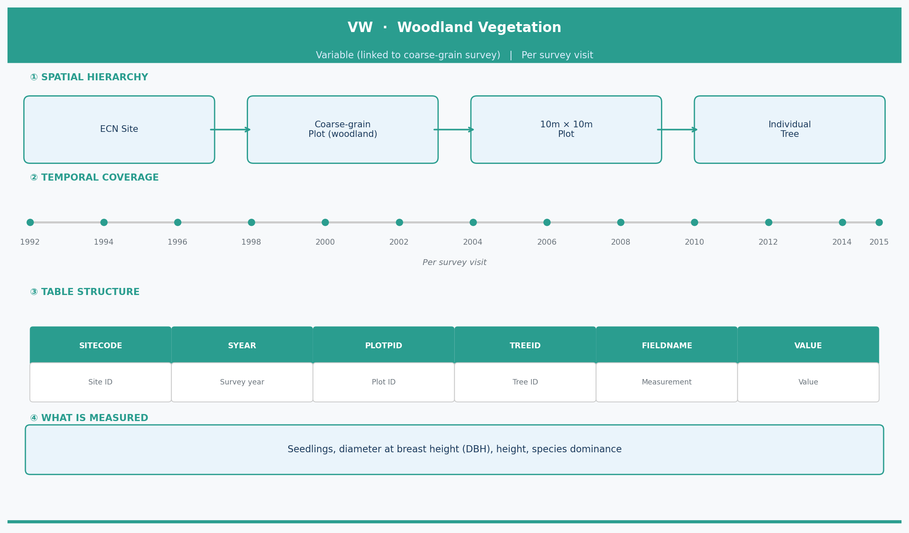
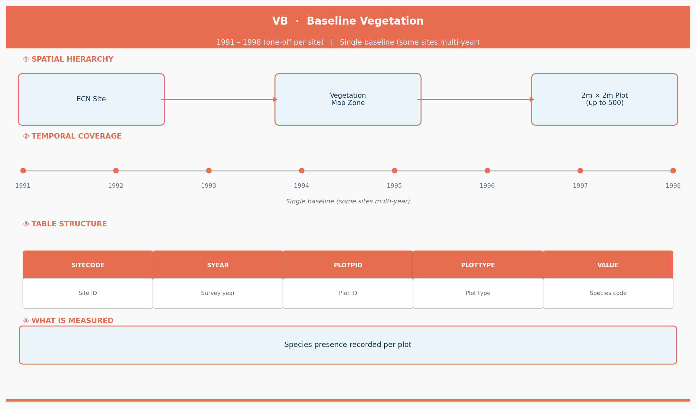
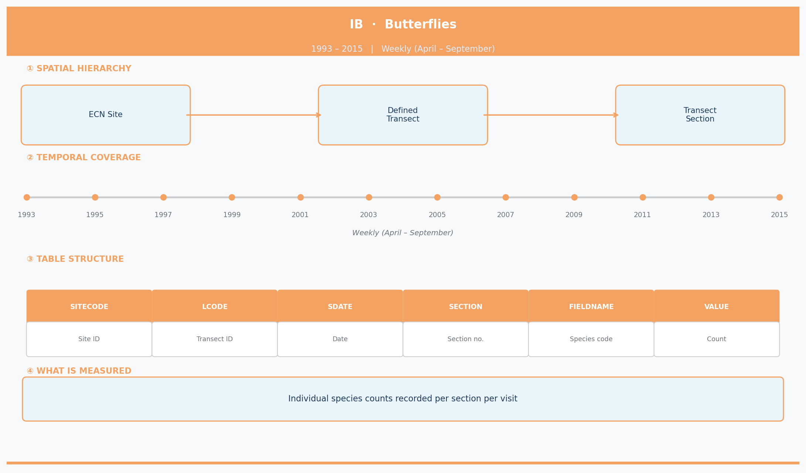
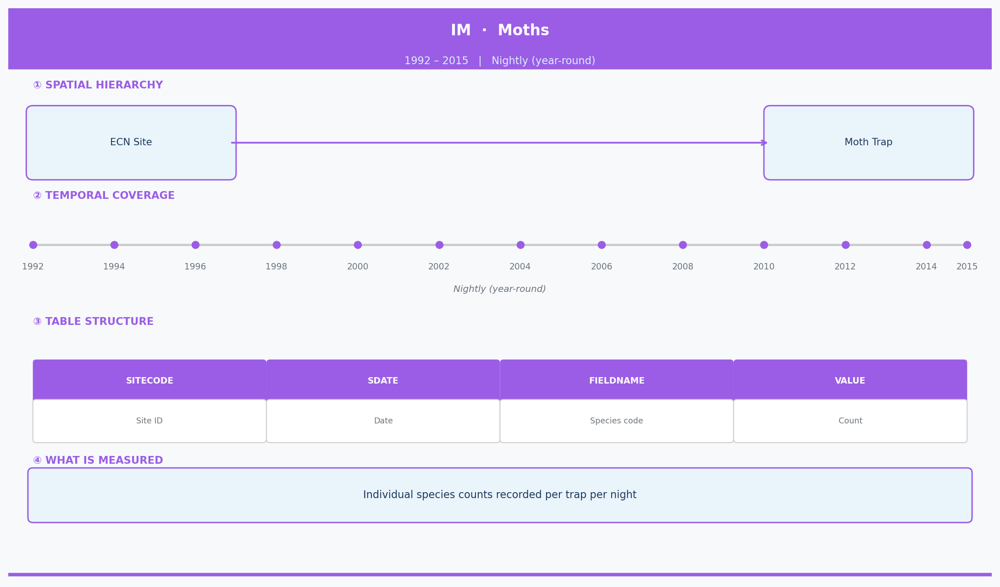

```{r setup, include=FALSE}
knitr::opts_chunk$set(echo = TRUE)
library(tidyverse)
library(dplyr)
library(ggplot2)
```


# Task 1: Context and study design
a. __Baseline__ - Measures the initial status of vegetation at each 
site and record a species list of all vascular (non-wood/rock-based)  
plants, bryophytes and lichens. Variabes such as altitude, slope, and aspect are
also recorded.
__Fine-grain__ - A detailed status analysis of all vascular plants, 
bryophytes and lichens (non wood or rock based) as well as ground types 
(i.e. bare soil, litter, rock) in each region.
__Woodland__ - Records tree/shrub metrics in the region, including: height,
 seedling counts, species dominance classes, diameter at breast 
height.
__Butterflies__ - Measures the number of butterflies using an imaginary 
5x5x5 (metre) transect. Recorded variables are: start time, temperature, % of sun, wind speed.
__Moths__ - Records the number of macrolepidoptera moths collected nightly 
using a standard "Rothamsted" light trap, identified with the RIS coding system. 
The light trap start date, time period and sampling date are recorded.

b. The main difference in the measurements in the units. The Vegetation __VB__, 
__VF__ datasets record presence/absence whereas the invertebrates __IB__, __IM__ datasets
focus on the counts of the species in the region. On the other hand, the __VW__ 
dataset takes a different approach by analysing growth metrics for individual
species. Finally, the __IB__ dataset is the only one that monitors weather conditions
during the sampling time frame.

c. The sites from which samples are taken are a selection of the following:
**Drayton, Glensaugh, Hillsborough, Moor House, North Wyke, Rothamsted,**
**Sourhope, Wytham, Alice Holt, Porton Down, Y Wyddfa, Cairgomrms**. __IM__
data is recorded nightly, __IB__ is recorded weekly between April and September, __VF__ and
__VW__ (diameter at breast height) recordings occur every 3 years and the remainder of 
__VW__ occur every 9 years. __VB__ is a one off survey conducted at the start.
The ECN data has been collected over the course of 9-25 years, with all of the schemes beginning in
the 1990s and terminating by 2015.

d. The data supports research following: the impacts of climate change
(eg. affect on numbers of butterflies); the fertility of soil (eg. tree growth);
atmospheric pollutants (eg. nitrogen impact on plant diversity); and the impact 
of geographical location. The use of the **NVC**
standard ensures that data can be appropriately compared to UK-wide trends.


# Task 2: Diagrams 

## Fine-grain vegetation
```{r Fine-grain data diagram, out.width='80%'}

```

## Woodland
```{r Woodland data diagram, out.width='80%'}

```

## Baseline vegetation
```{r Baseline vegetation data diagram, out.width='80%'}

```

## Butterflies
```{r Butterfly data diagram, out.width='80%'}

```

## Moths
```{r Moth data diagram, out.width='80%'}

```


# Task 3: Data quality assessment 

## Fine-grain vegetation

```{r}
vf_data <- read.csv("ECN_VF1.csv")
str(vf_data)
```

```{r, fig.cap = "Timeline of Sampling Years by Site VF", fig.pos="H",out.width="100%", fig.align="center"}
vf_timeline <- vf_data %>%
  select(SITECODE, SYEAR) %>%
  distinct()

ggplot(vf_timeline, aes(x = SYEAR, y = SITECODE)) +
  geom_point(color = "blue") +
  scale_x_continuous(breaks = seq(min(vf_timeline$SYEAR), max(vf_timeline$SYEAR)
                                  , by = 2)) +
  labs(
    title = "Sampling Timeline by Site VF",
    x = "Sampling Year",
    y = "Site Code"
  ) +
  theme(
  panel.grid.minor = element_blank(),
  plot.title = element_text(hjust = 0.5)
)
```

```{r,fig.pos="H"}
vf_gap_summary <- vf_data %>%
  distinct(SITECODE, SYEAR) %>%
  group_by(SITECODE) %>%
  arrange(SYEAR) %>%
  mutate(Gap = SYEAR - lag(SYEAR)) %>%
  summarise(
    Total_Visits = n(),
    Avg_Gap = round(mean(Gap, na.rm = TRUE), 1),
    Max_Gap = max(Gap, na.rm = TRUE),
  )

print(vf_gap_summary)
```

```{r, fig.cap = "Cells per Plot VF", fig.pos="H",out.width="80%", fig.align="center"}
cell_summary <- vf_data %>%
  group_by(SITECODE, SYEAR, PLOTPID) %>%
  summarise(Actual_Cells = n_distinct(CELLID), .groups = "drop")

ggplot(cell_summary, aes(x = factor(Actual_Cells))) +
  geom_bar(fill = "lightblue") +
  labs(
    title = "Cells per Plot VF",
    x = "Number of Cells Recorded",
    y = "Number of Plots"
  ) +
  theme(
  panel.grid.minor = element_blank(),
  plot.title = element_text(hjust = 0.5)
)
```

**General Overview** - The Fine-grain dataset shows notable temporal and spatial inconsistencies. The protocol specifies strict three-year sampling cycles to monitor biodiversity change. However, analysis reveals substantial over-sampling alongside occasional long gaps between surveys. Data validity is further reduced by deviations from the 10-cell sampling rule, with many plots containing 11 cells (Figure 9). The dataset is also partly incomplete due to temporal gaps, including cases where sampling did not occur for up to 6 years.

**Missingness** - The dataset is partially incomplete because of significant temporal gaps. This is most evident at Site T06, where no sampling occurred between 2000 and 2006 (see Figure 8). There is also a clear imbalance in sampling effort, with some years over-sampled and others entirely missing.

1 - **Uneven Sampling Frequency** - Evidence: The VF protocol states that sampling should follow three-year cycles. However, the table vf_gap_summary shows an average gap of around 1.2 years for most sites, indicating that annual sampling was often carried out instead.
Consequences: This uneven frequency introduces strong species bias. Sites sampled more frequently accumulate more records than those visited less often, creating skewed comparisons and potentially misleading biodiversity conclusions. Frequent sampling also increases the likelihood of detecting rare species due to random conditions such as weather events.

2 - **Cell Inconsistency** - Evidence: The protocol requires exactly 10 cells per plot. Figure 9 shows that over 1000 plots recorded 11 cells instead.
Consequences: This inconsistency reduces data validity. Plots with 11 cells cover a larger area, which naturally increases species counts and inflates perceived biodiversity. Because sampling effort differs, results are not directly comparable.


## Woodland
```{r Woodland DQA}
vw_data <- read.csv("ECN_VW1.csv")
str(vw_data)
```

```{r, fig.pos = "H"}
vw_growth_check <- vw_data %>%
  filter(FIELDNAME == "DIAMETER") %>%
  group_by(SITECODE, PLOTPID) %>%
  summarise(
    Year1_Avg = mean(VALUE[SYEAR == min(SYEAR)]),
    FinalYear_Avg = mean(VALUE[SYEAR == max(SYEAR)]),
    Growth = FinalYear_Avg - Year1_Avg,
    .groups = "drop"
  ) %>%
  filter(Growth < 0)

print(vw_growth_check)
```

```{r, fig.cap = "Timeline of Sampling Years by Site VW", fig.pos="H",out.width="100%", fig.align="center"}
vw_timeline <- vw_data %>%
  select(SITECODE, SYEAR, FIELDNAME) %>%
  distinct() %>%
  mutate(Type = ifelse(FIELDNAME == "DIAMETER", "DIAMETER", "Other"))

ggplot(vw_timeline, aes(x = SYEAR, y = SITECODE, shape = Type, color = Type)) +
  geom_point(size = 4, alpha = 0.8) + 
  scale_x_continuous(breaks = seq(min(vw_timeline$SYEAR), max(vw_timeline$SYEAR), by = 2)) +
  scale_shape_manual(values = c("DIAMETER" = 8, "Other" = 16)) + 
  scale_color_manual(values = c("DIAMETER" = "darkblue", "Other" = "red")) +
  labs(
    title = "VW Sampling Timeline",
    x = "Sampling Year",
    y = "Site Code",
    shape = "Measurement Type",
    color = "Measurement Type"
  ) +
  theme(legend.position = "bottom")
```

```{r, fig.cap = "Woodland Plots by Site", fig.pos="H",out.width="100%", fig.align="center"}
woodland_check <- vb_data %>%
  filter(PLOTTYPE == "W") %>%
  group_by(SITECODE) %>%
  summarise(Woodland_Plots_Exist = n())

barplot(woodland_check$Woodland_Plots_Exist, names.arg = woodland_check$SITECODE, 
        main="Woodland Plots by Site", ylab="Number of Plots",  xlab ="Site Code")
```

**General Overview** - The Woodland dataset shows major completeness issues and is the most limited of the three vegetation studies. Cross-referencing with the VB dataset indicates woodland habitats at 7 ECN sites (Figure 11), yet only 4 were included in monitoring. Data validity is also reduced by impossible values, such as trees decreasing in diameter over time. In addition, the 3- and 9-year sampling cycles outlined in the protocol are not consistently followed.

**Missingness** - The dataset contains substantial missing data and appears biased toward larger sites. The protocol requires surveys every 3 years for DIAMETER and every 9 years for other variables. While Sites T08 and T09 broadly follow this, Sites T05 and T06 only conducted initial surveys in 1994 with no follow-up. As a result, there is no repeated data, undermining the long-term purpose of the study.

1 - **Sampling issues** - Evidence: Figure 11 shows the distribution of woodland plots across ECN sites. Sites T03 and T10 contain a large number of woodland plots but are completely absent from VW sampling.
Consequences: This uneven coverage introduces representation bias. Only 4 sites were sampled, and just 2 of these include repeated measurements (Figure 10). As a result, findings rely heavily on a very small subset of sites, making them unsuitable for broader conclusions.

2 - **Trees Shrinking** - Evidence: The first table shows 12 cases where the Year 1 average DIAMETER exceeds the Final Year average DIAMETER for the same plot, which is not physically possible.
Consequences: This seriously reduces data reliability and suggests errors in measurement or data entry. It may also indicate issues with equipment calibration, which undermines confidence in the entire woodland dataset.


## Baseline vegetation
```{r Baseline DQA}
vb_data <- read.csv("ECN_VB1.csv")

str(vb_data)
```

```{r,fig.pos="H"}
year_check <- vb_data %>%
  group_by(SITECODE) %>%
  summarise(
    Years_Sampled = n_distinct(SYEAR),
    List_of_Years = paste(sort(unique(SYEAR)), collapse = ", "))

print(year_check)
```

```{r, fig.cap="Sampling Effort VB", fig.pos = "H", out.width="80%", fig.align="center"}
effort_check <- vb_data %>%
  group_by(SITECODE) %>%
  summarise(Total_Plots = n_distinct(PLOTPID))

barplot(effort_check$Total_Plots,names.arg = effort_check$SITECODE, 
        main="Sampling Effort by Site", ylab = "Number of Plots", xlab ="Site")
abline(h=400, lty = 2)
```

```{r, fig.cap = "Number of Unique Species by Site VB", fig.pos="H",out.width="80%", fig.align="center"}
# Count how many unique species were found at each site
unique_species <- vb_data %>%
  filter(FIELDNAME == "VEG_SPEC") %>%
  group_by(SITECODE) %>%
  summarise(Unique_Species = n_distinct(VALUE))

# Plot the numbers by site in descending order
ggplot(unique_species, aes(x = reorder(SITECODE, -Unique_Species), y = 
                             Unique_Species)) +
  geom_col(fill = "lightblue") +
  labs(title = "Total Unique Species Recorded per Site (Baseline)",
       x = "Site Code", y = "Count of Unique Species")
```

**General Overview** - The VB dataset shows strong labeling consistency, with plot and species naming conventions applied uniformly across all 52,033 observations. However, data validity is reduced by repeated sampling, which violates the one-off survey rule. The dataset also lacks timeliness and completeness. As a baseline survey, sampling should occur once, yet this requirement was frequently not followed (see table above). In total, 7 sites failed to meet this rule, with Site T11 conducting surveys across 5 different years. In addition, spatial coverage is limited, with most sites sampling far fewer plots than expected.

**Missingness** in the data is evident when examining sampling effort patterns. The first bar plot shows that only 3 sites achieved the expected 400 sampled plots. There is a clear relationship between sampling effort and species records, as Site T06 sampled only 25 plots and recorded fewer than 50 unique species (Figure 7). This indicates that missingness is non-random and strongly influenced by sampling effort at each site.

**Data Issues**
**1** - Uneven Sampling Effort - Evidence: The protocol target for the baseline survey was around 400 plots. Figure 6 shows highly uneven sampling, with only 3 sites reaching this target. While Sites T02, T07, and T11 met expectations, Site T06 recorded just 25 plots.
Consequences: This uneven effort introduces substantial bias in species counts. Because Site T06 sampled under 10% of the target, its species total is much lower than others (Figure 7). This makes it difficult to determine whether the site is truly less biodiverse or simply under-sampled.

**2** - Time Inconsistency - Evidence: The protocol states that the VB survey should be conducted once at the start of the study. The table shows that 7 of the 12 sites did not follow this, often sampling over multiple years. Site T11’s baseline spans 5 years, representing particularly poor practice.
Consequences: This undermines the concept of a “baseline,” as it no longer reflects a single point in time but instead captures change over several years. This makes it difficult to establish an initial condition. Since fine-grain surveys operate on 3-year cycles, a 5-year baseline makes it challenging to separate true variation from the starting state.

## Butterflies
```{r Butterfly DQA}
ib_data <- read.csv("ECN_IB1.csv")
str(ib_data)
```

```{r, fig.cap = "Sampling Effort IB", fig.pos="H",out.width="100%", fig.align="center"}
#add a month field to the df.
ib_data$MONTH <- format(as.Date(ib_data$SDATE, format = "%d-%b-%y"), "%m")
month_counts <- table(ib_data$MONTH)

barplot(month_counts, 
        main="IB Sampling Effort by Month", ylab="Number of Observations",
        xlab = "Month")
```

```{r}
ib_outliers <- ib_data %>%
  filter(VALUE > 100) %>%
  arrange(desc(VALUE))

print(ib_outliers)
```

```{r, fig.cap = "Weeks Sampled IB", fig.pos="H",out.width="100%", fig.align="center"}
ib_effort <- ib_data %>%
  mutate(
    DATE = as.Date(SDATE, format = "%d-%b-%y"),
    YEAR = as.numeric(format(DATE, "%Y")),
    WEEK = week(DATE)
  ) %>%
  group_by(SITECODE, YEAR) %>%
  summarise(Weeks_Sampled = n_distinct(WEEK), .groups = "drop")

ggplot(ib_effort, aes(x = YEAR, y = SITECODE, fill = Weeks_Sampled)) +
  geom_tile(color = "white") +
  scale_fill_gradient2(low = "yellow", mid = "green", high = "darkblue", midpoint = 13) +
  labs(
    title = "IB Sampling Effort: Weekly Coverage per Year",
    subtitle = "Target: 26 weeks per year (April-September)",
    x = "Year",
    y = "Site Code",
    fill = "Weeks Sampled"
  )
```

**General Overview** - The Butterfly dataset performs poorly across all four key aspects. It is highly incomplete, with most sites failing to meet the 26-week annual sampling target. Sampling effort is also inconsistent, with some sites recording little to no data in certain years. The dataset shows weaknesses in timeliness and long-term monitoring, as sampling effort declines noticeably toward the end of the study period. In addition, data validity is reduced by implausible counts and frequent breaches of strict protocol rules.

**Missingness** - The dataset contains substantial missing data. The protocol requires 26 weeks of sampling per year, yet the heatmap (Figure 13) shows that most sites do not achieve this target. Many cells are yellow or orange, indicating fewer than 15 weeks of sampling. There is also a clear decline in sampling effort after 2012, with Sites T06 and T07 disappearing entirely in later years.

**Data Issues**
**1** - Seasonal issues - Evidence: The protocol specifies that sampling should occur only between April and September, yet the bar plot (Figure 14) shows many observations recorded in March and October.
Consequences: These observations fall outside the defined sampling window. Butterfly activity is likely lower during these months, making any conclusions based on these data less reliable.

**2** - Unrealistic Counts - Evidence: The dataset includes extremely high counts, such as 234 butterflies of species 84 recorded within a single 5m × 5m × 5m area.
Consequences: Such values are highly unrealistic and suggest counting errors. This may be due to double counting or incorrect survey boundaries. Given the physical constraints, recording over 200 butterflies in such a small area is unlikely, raising concerns about the reliability of the data.


## Moths
```{r Moth DQA}
im_data <- read.csv("ECN_IM1.csv")
str(im_data)
```

```{r, fig.cap = "Moth Distribution by Month", fig.pos="H",out.width="100%", fig.align="center"}
im_data$MONTH <- format(as.Date(im_data$SDATE, format = "%d-%b-%y"), "%m")

im_month_table <- as.data.frame(table(im_data$MONTH))
colnames(im_month_table) <- c("Month", "Record_Count")

bp <- barplot(im_month_table$Record_Count, 
        names.arg = im_month_table$Month,
        main = "Seasonal Distribution of Moth Records",
        xlab = "Month",
        ylab = "Number of Observations")
```

```{r}
# Find species that appear only once per site across all years
im_singletons <- im_data %>%
  group_by(SITECODE, FIELDNAME) %>%
  summarise(Occurrences = n(), .groups = "drop") %>%
  filter(Occurrences == 1)

print(im_singletons)
```

```{r, fig.cap = "Gaps in Sampling - July and August", fig.pos="H",out.width="100%", fig.align="center"}
im_gaps <- im_data %>%
  mutate(DATE = as.Date(SDATE, format = "%d-%b-%y")) %>%
  select(SITECODE, DATE) %>%
  distinct() %>%
  group_by(SITECODE) %>%
  arrange(DATE) %>%
  mutate(Gap = as.numeric(difftime(DATE, lag(DATE), units = "days"))) %>%
  filter(Gap > 1 & format(DATE, "%m") %in% c("07", "08"))

ggplot(im_gaps, aes(x = DATE, y = SITECODE, color = Gap)) +
  geom_segment(aes(xend = DATE, yend = SITECODE, x = DATE - Gap), linewidth = 3) +
  scale_color_gradient(low = "orange", high = "red") +
  labs(title = "Moth Trap Gaps in July and August",
       x = "Date", y = "Site Code", color = "Days Missing") +
  theme_minimal()
```

**General Overview** - The overall trend in the moth dataset appears reasonably valid, as the distribution (Figure 14) follows the expected seasonal pattern, with peak counts occurring in the summer months. However, the dataset is highly incomplete, with long periods of missing data during key summer months. There are also inconsistencies, including a large number of singleton records, which may indicate data entry errors. Although recording is generally timely due to year-round nightly sampling, several sites contain substantial gaps where no data were collected.

**Missingness** - This dataset shows considerable missingness, particularly during the core summer period. The protocol requires nightly sampling throughout the year, but the sampling gap timeline reveals frequent and sometimes prolonged gaps, suggesting possible equipment failures or interruptions in data collection.

**Data Issues**
**1** - Singleton Moths - Evidence: The table shows that 540 species were recorded only once at a site over the 20-year study period, which is highly unlikely.
Consequences: This large number of singletons suggests potential inaccuracies, possibly due to data entry errors. It artificially inflates estimates of biodiversity and reduces the reliability of the dataset for comparative analysis.

**2** - Incompleteness - Evidence: Figure 15 shows consistent and sometimes large gaps in sampling during July and August. While most sites have shorter gaps, Site T12 has a particularly large gap of around 150 days during summer 2004.
Consequences: These months are critical for moth activity, as shown in Figure 14. Missing data during this period leads to substantial underestimation of annual abundance, making the dataset unreliable for population analysis. Extended gaps also reduce annual averages and distort overall trends.


# Task 4: Exploratory data analysis 

## Fine-grain vegetation
```{r Fine-grain EDA}
vf_counts <- aggregate(CELLID ~ SITECODE + SYEAR + PLOTPID + VALUE, 
                       data = vf_data, FUN = function(x) length(unique(x)))

hist(vf_counts$CELLID, 
     main = "Species Distributions Within Plot (VF)",
     xlab = "Number of Cells Occupied per Plot",
     ylab = "Frequency of Species Instances")
```

**Part A: Univariate Structure**

**Question:** We investigate the distribution of within-plot cell occupancy per species to determine whether fine-grain plots are characterised by spatially restricted specialists or by a small number of dominant, widespread species.

**Justification:** A histogram of cells occupied per species per plot is used, as cell occupancy is a direct spatial measure of how widely each species is distributed within the standardised 10-cell plot grid. This reveals community structure without collapsing spatial information.

**Results:** The distribution is bimodal. A dominant peak at one cell accounts for over 15,000 instances, reflecting highly localised species occurrences. A secondary peak at 10 cells — the maximum possible — indicates over 5,000 instances where a species occupies the entire plot.

**Interpretation:** The two peaks represent two ecologically distinct plant strategies. Species occupying a single cell are micro-habitat specialists constrained to very specific soil, moisture, or light conditions. Those occupying all 10 cells are habitat-defining dominants — typically grasses or sedges — whose distribution spans the entire plot. The bimodal structure is therefore a genuine reflection of community-level processes rather than a sampling artefact, and demonstrates the dataset's capacity to distinguish dominant from subordinate species.

```{r, fig.cap = "VF Unique Species by Survey Visit", fig.pos="H",out.width="100%", fig.align="center"}
vf_visits <- vf_data %>%
  group_by(SITECODE, SYEAR) %>%
  summarise(Richness = n_distinct(VALUE), .groups = "drop") %>%
  group_by(SITECODE) %>%
  arrange(SYEAR) %>%
  mutate(Visit_Number = row_number())

ggplot(vf_visits, aes(x = as.factor(Visit_Number), y = Richness, fill = as.factor(Visit_Number))) +
  geom_boxplot(alpha = 0.7) +
  geom_jitter(width = 0.1, alpha = 0.3) +
  labs(title = "Unique Species by Survey Visit (VF)",
       x = "Visit Number (Chronological Sequence)",
       y = "Unique Species per Plot") +
  theme(legend.position = "none", plot.title = element_text(hjust = 0.5))
```

**Part B: Temporal Dynamics**

**Question:** We investigate whether the per-site species richness recorded in fine-grain vegetation surveys changes systematically across successive survey visits, or remains stable over the monitoring period.

**Justification:** A boxplot of unique species per site grouped by chronological visit number is used. Jittered individual points are overlaid to preserve visibility of the raw data distribution. Indexing by visit number rather than calendar year standardises the comparison across sites with different starting years.

**Results:** Species richness remains broadly stable across visits 1 to 17, with the median consistently between approximately 80 and 110 species and limited inter-visit variation. Visits 18 and 19 show a pronounced upward shift, with median richness rising sharply to approximately 170 species per plot at visit 19.

**Interpretation:** The apparent increase at visits 18 and 19 is not a genuine network-wide biodiversity trend. As established in the data quality analysis, only two to three sites reached 18 or 19 visits, and these are among the most species-rich sites in the network. The elevated medians at late visit numbers therefore reflect the composition of the remaining sample rather than true temporal change, and should be interpreted with caution.

```{r, fig.cap = "VF Species Distribution Across Plot", fig.pos="H",out.width="100%", fig.align="center"}
vf_cells_occupied <- vf_data %>%
  group_by(SITECODE, PLOTPID, VALUE) %>%
  summarise(Cells_Occupied = n_distinct(CELLID), .groups = "drop")

ggplot(vf_cells_occupied, aes(x = reorder(SITECODE, Cells_Occupied, FUN = median), 
                          y = Cells_Occupied, fill = SITECODE)) +
  geom_boxplot(outlier.alpha = 0.2, show.legend = FALSE) +
  coord_flip() +
  labs(title = "Spatial Variation: Species Distribution Across Plot (VF)",
       x = "Site Code", 
       y = "Number of Cells Occupied per Species")
```

**Part C: Spatial Variation**

**Question:** We investigate how the spatial spread of species within fine-grain plots varies across ECN sites to determine whether sites differ in the degree of habitat specialisation or dominance.

**Justification:** Boxplots of cells occupied per species, grouped by site and ordered by median, allow simultaneous comparison of central tendency, spread, and outlier structure across all 12 sites without aggregating away within-site variation.

**Results:** Median cell occupancy varies considerably across sites. T07 and T01 show the highest medians at approximately 5 cells, suggesting broadly distributed species assemblages. T03 and T09 have markedly lower medians, indicating predominantly localised species. T10 is notable for its exceptionally large upper whisker, with some species occupying the full 10-cell plot despite a low median.

**Interpretation:** The inter-site variation is consistent with genuine ecological differences in habitat structure. Low-median sites such as T03 and T09 likely support vegetation communities constrained by soil heterogeneity or topographic variation, producing spatially restricted species. High-median sites like T07 reflect more homogeneous habitats where species are able to spread uniformly. T10's high upper whisker suggests the presence of one or two strongly dominant species — potentially a competitive grass — coexisting with a more localised subordinate community.

```{r, fig.cap = "VF Plot Dominance vs Unique Species", fig.pos="H",out.width="100%", fig.align="center"}
vf_dominance <- vf_data %>%
  group_by(SITECODE, SYEAR, PLOTPID) %>%
  summarise(
    Max_Occupancy = max(table(VALUE)), 
    Total_Species = n_distinct(VALUE),
    .groups = "drop"
  )

ggplot(vf_dominance, aes(x = Max_Occupancy, y = Total_Species)) +
  geom_jitter(alpha = 0.2, color = "darkgreen", width = 0.3) +
  geom_smooth(method = "lm", color = "black", se = TRUE) +
  labs(title = "Plot Dominance vs Unique Species",
       x = "Max Cells Occupied by One Species",
       y = "Total Unique Species in Plot") +
  theme(plot.title = element_text(hjust = 0.5))
```

**Part D: Relationships**

**Question:** We investigate whether the spatial dominance of a single species within a plot is associated with higher or lower overall species richness, to determine whether dominant plants suppress or facilitate botanical diversity.

**Justification:** A scatterplot with a fitted OLS regression line and confidence interval is used to compare the maximum cell occupancy of the most dominant species in each plot against the total count of unique species recorded in that plot.

**Results:** A moderate positive trend is evident despite considerable scatter around the regression line. Plots in which one species occupies the maximum number of cells do not show reduced species richness — the relationship is positive across the full range of dominance values.

**Interpretation:** The counter-intuitive positive relationship is consistent with the ecological facilitation hypothesis, whereby dominant species — typically structurally complex plants such as tussock grasses — create heterogeneous micro-habitats that enable subordinate species to persist. Additionally, high dominance values tend to co-occur in productive, high-quality habitats where resources are sufficient to sustain both dominant and subordinate species simultaneously. The opposing dynamic, where dominance excludes diversity, likely occurs at individual plot level but is not strong enough to override the network-wide positive trend.

## Woodland
```{r Woodland EDA}
vw_diam_dist <- vw_data %>%
  filter(FIELDNAME == "DIAMETER", VALUE < 150)

ggplot(vw_diam_dist, aes(x = VALUE)) +
  geom_histogram(color = "black", bins = 30) +
  labs(title = "Univariate Structure: Tree Diameter Distribution (VW)",
       x = "Diameter at Breast Height (cm)",
       y = "Frequency") +
  theme(plot.title = element_text(hjust = 0.5))
```

**PartA: Univariate Structure**

**Question:** We investigate the distribution of tree diameters at breast height to characterise the structural maturity and size-class composition of woodland across the ECN network.

**Justification:** A histogram of diameter values is used as diameter at breast height (DBH) is the standard silvicultural measure of tree size and developmental stage, directly reflecting stand structure and age-class distribution.

**Results:** The distribution is strongly right-skewed, with the mode concentrated between 10 and 20 cm. Frequency declines sharply with increasing diameter, producing a long, thin right tail. Values at or near zero are present, as are extreme outliers beyond 150 cm which have been excluded from this plot.

**Interpretation:** The reverse-J shaped size distribution is the canonical signature of an uneven-aged or naturally regenerating woodland stand, where recruitment of young small-diameter stems consistently exceeds the number reaching larger size classes due to competition-driven mortality. The near-zero diameter records and extreme outliers identified in the data quality analysis introduce noise into the left and right tails respectively and should not be treated as genuine biological observations.

```{r, fig.cap = "VW Forest Growth by Survey Visit", fig.pos="H",out.width="100%", fig.align="center"}
vw_visit_clean <- vw_data %>%
  filter(FIELDNAME == "HEIGHT") %>%
  filter(VALUE < 60) %>% 
  group_by(SITECODE) %>%
  mutate(Visit_Num = as.numeric(as.factor(SYEAR))) %>%
  ungroup()

ggplot(vw_visit_clean, aes(x = as.factor(Visit_Num), y = VALUE, fill = as.factor(Visit_Num))) +
  geom_boxplot(outlier.alpha = 0.4, outlier.size = 1) +
  labs(title = "Forest Growth by Survey Visit",
       x = "Visit Number",
       y = "Height (m)",
       fill = "Visit Number") +
  theme(plot.title = element_text(hjust = 0.5))
```

**Part B: Temporal Dynamics**

**Question:** We investigate how recorded tree height changes across successive survey visits to determine whether the VW dataset captures the expected pattern of woodland growth over time.

**Justification:** A boxplot of tree height grouped by visit number is used, with extreme outliers (heights exceeding 60 m) filtered to ensure the inter-quartile ranges are legible. Indexing by visit number rather than calendar year accounts for differing survey start dates across sites.

**Results:** Median height at visits 1 and 2 is approximately 11 m. A pronounced drop occurs at visit 3, where the median falls to approximately 4 m, before recovering to around 13 m by visit 4.

**Interpretation:** The decrease at visit 3 is inconsistent with any biological growth process and is attributable to the data quality issues identified previously. As only two sites contributed data beyond the first visit, the visit 3 sample is unrepresentative of the network. Furthermore, erroneous records — including trees recorded as shrinking between visits — distort the height distribution at later visits, making temporal inference from this dataset unreliable without prior correction of these anomalies.

```{r, fig.cap = "VW Height by Site", fig.pos="H",out.width="100%", fig.align="center"}
vw_spatial_h <- vw_data %>%
  filter(FIELDNAME == "HEIGHT", VALUE < 60)

ggplot(vw_spatial_h, aes(x = reorder(SITECODE, VALUE, FUN = median), y = VALUE, fill = SITECODE)) +
  geom_boxplot(alpha = 0.7, show.legend = FALSE) +
  labs(title = "Height (By Site)",
       x = "Site Code",
       y = "Tree Height (m)") +
  theme(plot.title = element_text(hjust = 0.5))
```

**Part C: Spatial Variation**

**Question:** We investigate how tree height varies across ECN sites to identify differences in forest maturity and stand structure at a national scale.

**Justification:** Boxplots of tree height ordered by site median allow the central tendency, dispersion, and outlier profile of each site to be compared directly, providing a rapid assessment of structural variation across the network.

**Results:** T08 has the highest median height at approximately 11 m, with outliers reaching nearly 40 m. T09 and T06 have similar medians but markedly wider interquartile ranges; T09's lower quartile approaches 0 m, indicating a large proportion of near-ground-level records. The network-wide median is approximately 10 m.

**Interpretation:** The broadly consistent median height across sites suggests a degree of structural similarity in the ECN woodland network, though the wide variation in spread points to genuine differences in stand composition. T09's near-zero lower quartile is consistent with a mixed site containing both recently established recruits or coppice regrowth and taller mature trees. The data quality issues within this dataset — including zero-height and implausibly large records — limit the confidence with which between-site differences can be attributed to genuine ecological variation.

```{r, fig.cap = "VW Height vs Diameter", fig.pos="H",out.width="100%", fig.align="center"}
vw_rel <- vw_data %>%
  filter(FIELDNAME %in% c("DIAMETER", "HEIGHT")) %>%
  pivot_wider(id_cols = c(SITECODE, SYEAR, PLOTPID, TREEID), 
              names_from = FIELDNAME, 
              values_from = VALUE,
              values_fn = mean) %>%
  filter( DIAMETER < 200, HEIGHT < 50) 

ggplot(vw_rel, aes(x = DIAMETER, y = HEIGHT)) +
  geom_point(alpha = 0.2, color = "darkblue") +
  geom_smooth(method = "lm", color = "red") +
  labs(title = "Relationship: Height vs Diameter",
       x = "Diameter (cm)",
       y = "Height (m)") +
  theme(plot.title = element_text(hjust = 0.5))
```

**Part D: Relationships**

**Question:** We investigate the allometric relationship between tree diameter at breast height and tree height to determine whether the VW dataset conforms to the expected biological growth trajectory.

**Justification:** A scatterplot with a linear regression line is used to examine the relationship between DBH and height at the individual tree level, after filtering extreme values identified as likely data entry errors in the quality assessment.

**Results:** A strong positive correlation is evident across the full diameter range. Height increases approximately from 5 m at 10 cm DBH to nearly 50 m at the upper diameter limit. A horizontal cluster of observations at height 0 is visible and does not conform to the general trend.

**Interpretation:** The strong positive allometric scaling of height with diameter is consistent with well-established models of tree biomechanics, whereby increasing stem diameter provides the structural support necessary to sustain greater vertical growth. The tight clustering around the regression line indicates this relationship is robust across species and sites in the dataset. The zero-height cluster almost certainly represents data entry errors or fallen trees where the trunk persists but canopy height cannot be measured — a distinction that should be recorded explicitly in the survey protocol.

## Baseline vegetation
```{r Baseline EDA}
vb_counts <- as.data.frame(table(vb_data$VALUE))
colnames(vb_counts) <- c("Code", "Abundance")

hist(log10(vb_counts$Abundance), 
     main = "Species Count Distribution",
     xlab = "Log_10 of Count",
     ylab = "Number of Species")
```

**Part A: Univariate Structure**

**Question:** We investigate how botanical species are distributed across abundance classes to determine the balance between rare and common species in the dataset.

**Justification:** A $\log_{10}$-transformed histogram is used to compress the extreme right tail of the abundance distribution, allowing rare and common species to be visualised on the same axis without distortion from high-count outliers.

**Results:** The distribution is strongly right-skewed, with the highest frequency concentrated at the far left. Over 200 species appear extremely rarely in the dataset. Frequency declines steadily with increasing abundance, with only a handful of species reaching counts in the range of 10³.

**Interpretation:** The sharp left-side spike reflects a well-documented ecological phenomenon — most plant biodiversity is composed of rare specialists occurring only once or twice across sampled plots. The small right-tail bars represent widespread generalist species such as common grasses. This pattern is consistent with a typical species abundance distribution and is not an artefact of sampling design.

```{r, fig.cap = "VB Cumulative Species Findings Over Time", fig.pos="H",out.width="100%", fig.align="center"}
species_first_seen <- vb_data %>%
  group_by(VALUE) %>%
  summarise(First_Year = min(SYEAR)) %>%
  group_by(First_Year) %>%
  summarise(New_Species = n()) %>%
  mutate(Total_Species_Found = cumsum(New_Species))

ggplot(species_first_seen, aes(x = First_Year, y = Total_Species_Found)) +
  geom_line(color = "black", size = 1.2) +
  geom_point(size = 3, color = "cyan") +
  labs(title = "Cumulative Species Findings Over Time",
       x = "Baseline Start Year (SYEAR)",
       y = "Cumulative Unique Species") +
  theme_minimal()
```

**Part B: Temporal Dynamics**

**Question:** We investigate the rate of new species discovery over the survey period to assess whether the baseline sampling was sufficient to capture the full botanical diversity of the ECN network.

**Justification:** A cumulative species discovery curve is used, plotting the running total of unique species first recorded against survey year. This is a standard species accumulation approach that reveals whether the survey effort is approaching saturation.

**Results:** The curve rises steeply between 1991 and 1994, with the cumulative count increasing from approximately 150 to over 850 species. After 1995, the rate of new discoveries slows markedly, with the final five years contributing only around 100 additional species.

**Interpretation:** The rapid early accumulation reflects the initial baseline surveys capturing the majority of species richness across the network. The subsequent flattening is linked to the data quality issue identified in Part 3 — from 1995 onwards, sampling was largely confined to re-visits at previously surveyed sites, reducing the opportunity to encounter genuinely new species. The plateau therefore reflects survey design rather than true ecological saturation.

```{r, fig.cap = "VB Species by Plot Type", fig.pos="H",out.width="100%", fig.align="center"}
vb_spatial <- vb_data %>%
  group_by(SITECODE, SYEAR, PLOTPID, PLOTTYPE) %>%
  summarise(Richness = n_distinct(VALUE), .groups = "drop")

ggplot(vb_spatial, aes(x = PLOTTYPE, y = Richness, fill = PLOTTYPE)) +
  geom_boxplot() +
  labs(title = "Unique Species by Plot Type",
       x = "Plot Type", 
       y = "Number of Unique Species") +
  theme(plot.title = element_text(hjust = 0.5))
```

**Part C: Spatial Variation**

**Question:** We investigate whether species richness differs systematically between standard and woodland plot types to determine if habitat structure drives within-network botanical diversity.

**Justification:** A grouped boxplot is used to compare the distribution of per-plot species richness across plot types. This simultaneously displays median, spread, and outlier structure, enabling a direct comparison between the two habitat categories.

**Results:** Standard plots exhibit a higher median richness (approximately 14 species) compared to woodland plots (approximately 10). Standard plots also show considerably greater spread, with numerous high-value outliers, whereas woodland plot outliers are bounded at approximately 40 species.

**Interpretation:** The higher and more variable richness in standard plots is consistent with the ecological principle that open, non-canopied habitats support greater light penetration to ground level, enabling a more diverse understorey plant community. Woodland plots, by contrast, are frequently dominated by a small number of shade-tolerant species under closed canopy conditions, suppressing the establishment of light-demanding species and reducing overall richness.

```{r , fig.cap = "VB Sampling Effort vs Unique Species", fig.pos="H",out.width="100%", fig.align="center"}
vb_effort <- vb_data %>%
  group_by(SITECODE) %>%
  summarise(
    Total_Plots = n_distinct(PLOTPID),
    Total_Species = n_distinct(VALUE)
  )

ggplot(vb_effort, aes(x = Total_Plots, y = Total_Species)) +
  geom_point(size = 4, color = "darkblue") +
  geom_smooth(method = "lm", se = FALSE, color = "red") +
  geom_text(aes(label = SITECODE), vjust = -1, size = 3) +
  labs(title = "Site Sampling Effort vs Unique Species",
       x = "Number of Plots Surveyed at Site", 
       y = "Total Unique Species Found") +
  theme(plot.title = element_text(hjust = 0.5))
```

**Part D: Relationships**

**Question:** We investigate whether total species richness per site is primarily driven by sampling effort or whether it reflects genuine differences in habitat quality across ECN sites.

**Justification:** A scatterplot with an OLS regression line is used to assess the relationship between number of plots surveyed and unique species recorded per site. Labelling each point by site code allows individual deviations from the trend to be identified and interpreted.

**Results:** A moderate positive trend is present, though residual variation around the regression line is substantial. Site T04 stands out as a notable positive outlier, achieving the highest species richness despite only moderate sampling effort. Conversely, T07 surveyed nearly 500 plots yet recorded only approximately 180 unique species.

**Interpretation:** The wide scatter around the regression line suggests that sampling effort alone is not a reliable predictor of biodiversity. The contrasting behaviour of T04 and T07 is consistent with genuine habitat-driven variation — T04 is likely a structurally diverse grassland or hedgerow habitat where species turnover between plots is high, while T07 may represent a more homogeneous landscape where additional plots encounter largely the same species assemblage.

## Butterflies
```{r Butterfly EDA}
ib_cleaned <- ib_data[ib_data$VALUE <= 20, ]

hist(ib_cleaned$VALUE, 
     main = "Univariate Structure: Butterfly Abundance",
     xlab = "Number of Butterflies",
     ylab = "Frequency")
```

**Part A: Univariate Structure**

**Question:** We investigate the distribution of per-section butterfly counts to characterise typical population densities and the degree of zero-inflation in the IB dataset.

**Justification:** A histogram of count values is used, with extreme values above 20 removed prior to plotting. As identified in the data quality analysis, counts exceeding this threshold — including the maximum of 234 — are implausible for a single transect section and are likely recording errors rather than genuine observations.

**Results:** The distribution is extremely right-skewed. The vast majority of section-level records contain zero or one individual, with frequency declining sharply at higher counts even after filtering. The zero class dominates the distribution.

**Interpretation:** The predominance of very low counts is ecologically expected — butterflies are solitary insects that do not aggregate in large numbers under normal conditions, so single-individual sightings are the norm on a short transect section. The heavy zero-inflation reflects the structured nature of transect recording, where sections with no sightings are explicitly logged, rather than a deficiency in survey coverage. This distributional shape is consistent with count data from the UK Butterfly Monitoring Scheme more broadly.

```{r, fig.cap = "IB Butterfly Encounter Rate by Year", fig.pos="H",out.width="100%", fig.align="center"}
ib_data$YEAR <- as.numeric(format(as.Date(ib_data$SDATE, format = "%d-%b-%y"), "%Y"))
butterfly_success <- ib_data %>%
  group_by(YEAR) %>%
  summarise(Success_Rate = mean(VALUE > 0) * 100)

ggplot(butterfly_success, aes(x = YEAR, y = Success_Rate)) +
  geom_line(color = "black", size = 1.2) +
  geom_point(size = 3, color = "green") +
  labs(title = "Butterfly Encounter Rate",
       x = "Year",
       y = "Success Rate (%)") +
  theme(plot.title = element_text(hjust = 0.5))
```

**Part B: Temporal Dynamics**

**Question:** We investigate how the annual rate of butterfly detection changes over the monitoring period to determine whether occupancy — rather than raw abundance — shows a consistent long-term trend.

**Justification:** The proportion of sections recording at least one butterfly per year is calculated as a binary encounter metric. This measure is more robust to the extreme outlier counts identified in the quality analysis than raw abundance totals, as it is not inflated by a small number of anomalously high records.

**Results:** The encounter rate fluctuates across the monitoring period before rising sharply to a peak exceeding 85% in 2013. Following this peak, the rate stabilises at a level higher than that observed in earlier years, suggesting a sustained shift rather than a transient spike.

**Interpretation:** The 2013 peak coincides with one of the warmest UK summers on record, which is consistent with documented responses of butterfly communities to short-term temperature anomalies — warm conditions increase adult activity, flight duration, and reproductive success within a season. The persistence of elevated encounter rates post-2013 warrants further investigation but may reflect a genuine shift in community occupancy associated with longer-term warming trends, rather than a sampling artefact.

```{r, fig.cap = "IB Butterfly Abundance by Site", fig.pos="H",out.width="100%", fig.align="center"}
ggplot(ib_data, aes(x = reorder(SITECODE, VALUE, FUN = median), y = VALUE, fill = SITECODE)) +
  geom_boxplot(show.legend = FALSE, outlier.size = 0.5, alpha = 0.7) +
  coord_cartesian(ylim = c(0, 10)) +
  labs(title = "Butterfly Abundance by Site",
       x = "Site Code",
       y = "Butterfly Count Per Section (Value)") +
  theme(plot.title = element_text(hjust = 0.5))
```

**Part C: Spatial Variation**

**Question:** We investigate how butterfly abundance varies across ECN sites to identify which locations consistently support the highest densities and whether inter-site differences are ecologically meaningful.

**Justification:** Boxplots of per-section counts ordered by site median are used, with the y-axis restricted to 10 to allow the inter-quartile ranges to be interpreted without compression by extreme outliers. This focuses the comparison on typical abundance rather than exceptional events.

**Results:** Most sites show a median of zero or one individual per section. T09 shows the highest median at approximately 2, with the largest interquartile range across all sites. T12 records a near-flat distribution at zero, with almost no positive observations across its survey history.

**Interpretation:** The inter-site gradient from T12 to T09 likely reflects genuine differences in habitat quality. Sites with consistently higher medians are plausibly characterised by flower-rich grassland, providing both larval host plants and adult nectar resources. T12's near-zero profile may indicate a structurally poor habitat, management change, or the relatively recent establishment of monitoring at that site. The high frequency of outliers across all sites confirms that episodic large counts occur even at low-abundance locations, consistent with occasional mass emergence events or localised aggregation behaviour.

```{r, fig.cap = "IB Counts by Month", fig.pos="H",out.width="100%", fig.align="center"}
ib_data$MONTH <- format(as.Date(ib_data$SDATE, format = "%d-%b-%y"), "%m")

monthly_counts <- aggregate(VALUE ~ MONTH, data = ib_data, FUN = sum)

barplot(monthly_counts$VALUE,
        names.arg = monthly_counts$MONTH,
        main = "IB Counts by Month",
        xlab = "Month",
        ylab = "Number of Observations",
        border = "black")
```

**Part D: Relationships**

**Question:** We investigate the relationship between calendar month and total butterfly abundance to determine whether the IB dataset captures the expected seasonal flight phenology and to identify any records that fall outside the standard survey window.

**Justification:** A bar chart of total counts aggregated by month is used to visualise the full seasonal profile across all sites and years. Summing rather than averaging retains the contribution of high-abundance months and makes the phenological peak clearly visible.

**Results:** Total counts peak strongly in July and August, with marked declines either side. Records are present in March and October, both of which fall outside the April–September protocol sampling window described in the monitoring guidelines.

**Interpretation:** The summer peak is consistent with the known flight phenology of the most abundant UK butterfly species, the majority of which are univoltine or bivoltine with peak adult emergence between June and August. The presence of March and October records constitutes a protocol deviation that introduces a downward bias into monthly averages, as butterfly activity is naturally suppressed in cooler shoulder months. If these out-of-window records are retained in analyses, seasonal comparisons across years or sites may be distorted depending on whether all sites contributed equally to these non-standard survey dates.

## Moths
```{r Moth EDA}
ggplot(im_data, aes(x = VALUE)) +
  geom_density(fill = "violet", alpha = 0.5, color = "purple") +
  scale_x_continuous(trans = "log1p") +
  labs(title = "Univariate: Moth Population Density",
       subtitle = "Log(x+1) scale used to include zero counts and extreme outliers",
       x = "Moth Count (Log Scale: 0 to Max)",
       y = "Density") +
  theme_minimal()
```

**Part A: Univariate Structure**

**Question:** We investigate the distributional properties of moth trap counts to characterise the scale, shape, and zero-inflation of the IM dataset and to identify any anomalous features requiring further explanation.

**Justification:** A kernel density plot on a log(x+1) scale is used. The log transformation is necessary given the extreme range of count values, while the +1 offset preserves the substantial zero-count records that would otherwise be lost under a pure log transformation.

**Results:** The density plot reveals a high mass at zero on the far left, followed by a series of sharp, regularly spaced peaks at low count values. An isolated secondary mode is visible at approximately 300, separated from the main distribution by an extended low-density region. Peak amplitude declines in an approximately exponential pattern with increasing count.

**Interpretation:** The repeating discrete peaks are expected for trap count data, which records whole-number counts of individual moths and therefore produces a multimodal density under kernel smoothing. The isolated mode near 300 is ecologically unusual and is consistent with a single site or trap that consistently returns abnormally high counts — likely T12, identified in the spatial analysis as a moth density outlier. The exponential decay in peak amplitude reflects the standard biological pattern of many rare nights interspersed with occasional high-catch events.

```{r, fig.cap = "IB Counts by Month", fig.pos="H",out.width="100%", fig.align="center"}
im_data$MONTH_NUM <- as.numeric(format(as.Date(im_data$SDATE, format = "%d-%b-%y"), "%m"))

moth_monthly_total <- im_data %>%
  group_by(MONTH_NUM) %>%
  summarise(Total_Moths = sum(VALUE, na.rm = TRUE))

ggplot(moth_monthly_total, aes(x = MONTH_NUM, y = Total_Moths)) +
  geom_col(fill = "magenta", color = "white") +
  scale_x_continuous(breaks = 1:12) + 
  labs(title = "Temporal: Total Moth Counts by Month Number",
       subtitle = "1 = Jan, 12 = Dec",
       x = "Month Number",
       y = "Total Number of Moths Recorded") +
  theme_minimal()
```

**Part B: Temporal Dynamics**

**Question:** We investigate the monthly distribution of total moth catches to determine whether the IM dataset conforms to the expected seasonal flight phenology of UK moths, and to identify any months where count levels suggest a data quality issue.

**Justification:** Total moth counts are aggregated by calendar month and displayed as a bar chart. Summing across all years and sites provides a clear overview of the seasonal signal while highlighting months where abundance is unexpectedly high or low relative to biological expectations.

**Results:** Counts peak sharply in July and August, each exceeding 140,000 individuals. Counts in the remaining months — including October through May — remain comparatively elevated at approximately 50,000, with little variation between them.

**Interpretation:** The July–August peak is consistent with the known phenology of UK moth communities, which are most active during warm summer nights. However, the near-constant counts across winter months are biologically implausible — temperatures below approximately 8–10°C render most macro-moth species inactive, and catches in December and January should approach zero. The elevated non-summer values strongly suggest a data quality issue, potentially attributable to trap malfunction, species misidentification in records, or systematic recording errors at specific sites during colder months.

```{r, fig.cap = "IB Counts by Month", fig.pos="H",out.width="100%", fig.align="center"}
moth_density_site <- im_data %>%
  group_by(SITECODE) %>%
  summarise(Mean_Value = mean(VALUE, na.rm = TRUE))

ggplot(moth_density_site, aes(x = reorder(SITECODE, -Mean_Value), y = Mean_Value)) +
  geom_bar(stat = "identity", fill = "purple", color = "black") +
  theme_minimal() +
  theme(axis.text.x = element_text(angle = 45, hjust = 1)) +
  labs(title = "Spatial: Average Moth Density per Trap",
       subtitle = "Mean catch per site",
       x = "ECN Site Code",
       y = "Mean Moths per Trap (VALUE)")
```

**Part C: Spatial Variation**

**Question:** We investigate the variation in mean moth catch per trap across ECN sites to determine whether moth abundance is evenly distributed across the network or concentrated at a small number of high-density locations.

**Justification:** Mean catch per site is used rather than total catch, as it normalises for differences in the number of trap nights across sites and provides a comparable measure of per-unit-effort abundance regardless of sampling intensity.

**Results:** Site T12 is a substantial outlier, recording a mean catch exceeding 40 moths per trap — approximately four times higher than the next ranked site (T04) and roughly 20 times higher than the majority of remaining sites, which cluster at low mean values.

**Interpretation:** The extreme dominance of T12 in mean catch is indicative of a genuine ecological hotspot rather than a sampling artefact, given that it persists after normalising for effort. T12 may be situated adjacent to a large light source, within a particularly moth-rich habitat such as ancient woodland, or in a region with a distinctively warm local climate. The practical implication is that network-level analyses of moth abundance will be disproportionately influenced by T12, potentially masking trends at other sites. Analyses should consider stratifying or separately modelling this site.

```{r, fig.cap = "IB Counts by Month", fig.pos="H",out.width="100%", fig.align="center"}
moth_diversity <- im_data %>%
  group_by(SITECODE, SDATE) %>%
  summarise(
    Total_Count = sum(VALUE, na.rm = TRUE),
    Species_Richness = n_distinct(FIELDNAME),
    .groups = "drop"
  )

ggplot(moth_diversity, aes(x = Total_Count, y = Species_Richness)) +
  geom_point(alpha = 0.4, color = "magenta") +
  geom_smooth(method = "lm", color = "black") +
  labs(title = "Multivariate Audit: Abundance vs. Species Richness",
       x = "Total Moth Count (Abundance)",
       y = "Number of Unique Species (Richness)") +
  theme_minimal()
```

**Part D: Relationships**

**Question:** We investigate whether higher total moth catch on a given night at a given site is associated with greater species richness, or whether large catches are driven by the numerical dominance of a small number of species.

**Justification:** A scatterplot with a fitted linear regression line is used to compare total nightly catch against the number of unique moth species recorded per site-date combination. This directly tests whether abundance and diversity covary positively, as would be expected if all species benefit equally from favourable trapping conditions.

**Results:** The majority of points are concentrated at low count and low richness values. Among the high-count outliers, the relationship deviates markedly from the regression line — one record approaching 1,800 individuals is associated with fewer than 25 unique species, well below the trend. The overall regression slope is positive but the explained variance is low.

**Interpretation:** The positive but weak overall relationship is consistent with the expectation that nights or sites with good trapping conditions attract more individuals across more species. However, the outlier at near-1,800 individuals with fewer than 25 species indicates that the most extreme catch events are driven by the numerical explosion of a small number of species rather than a broad community response. This is biologically plausible — species such as large yellow underwing or common rustic can emerge en masse under specific temperature and wind conditions. The outlier may also point to a data quality issue if certain records aggregate counts across multiple nights or trap types.


# Task 5: Cross-data comparison for vegetation 
*Limits: 200 words text + 1 figure + 1 table.*

## Vegetation
```{r Vegetation}
vf_data <- read.csv("ECN_VF1.csv")
vw_data <- read.csv("ECN_VW1.CSV")

# Filtering the dataset by sites 
vf_richness <- vf_data %>%
  filter(FIELDNAME == "VEG_SPEC") %>%
  group_by(SITECODE, PLOTPID, SYEAR) %>%
  summarise(Unique_Species = n_distinct(VALUE), .groups = "drop") %>%
  filter(SITECODE %in% c("T05","T06","T08","T09"),
         SYEAR >= 1994, SYEAR <= 2014) %>%
  mutate(Dataset = "Fine-Grain (VF)")

vw_richness <- vw_data %>%
  filter(FIELDNAME == "DIAMETER") %>%
  group_by(SITECODE, PLOTPID, SYEAR) %>%
  summarise(Unique_Species = n_distinct(TREE_SPEC), .groups = "drop") %>%
  filter(SITECODE %in% c("T05","T06","T08","T09"),
         SYEAR >= 1994, SYEAR <= 2014) %>%
  mutate(Dataset = "Woodland (VW)")

combined <- bind_rows(vf_richness, vw_richness)

# Combined Graph
ggplot(combined, aes(x = Dataset, y = Unique_Species, fill = Dataset)) +
  geom_boxplot(outlier.size = 0.8, alpha = 0.8) +
  scale_fill_manual(values = c("Fine Grain (VF)" = "lightblue",
                                "Woodland (VW)" = "darkblue")) +
  labs(
    title = "Species Richness per Plot: Fine Grain vs Woodland",
    subtitle = "Shared sites (T05, T06, T08, T09), 1994-2014",
    x = "Dataset", y = "Unique Species per Plot"
  ) +
  theme_minimal() +
  theme(legend.position = "none")

summary_table <- combined %>%
  group_by(Dataset) %>%
  summarise(
    Sites = n_distinct(SITECODE),
    N_Plots = n_distinct(PLOTPID),
    Median_Richness = round(median(Unique_Species), 1),
    Mean_Richness = round(mean(Unique_Species), 1),
    Max_Richness = max(Unique_Species)
  )

knitr::kable(summary_table, caption = "Summary Statistics: VF vs VW Species Richness")
```

**Question**: We examine whether species richness per plot differs between fine-grain vegetation surveys and woodland tree surveys at shared sites, to assess whether any differences reflect ecological patterns or sampling design.

**Justification**: Data were subset to the four common sites (T05, T06, T08, T09) over the shared period (1994–2014). For VF, records were filtered to FIELDNAME == "VEG_SPEC", and richness was calculated as the number of distinct species per plot per year across 114 plots. For VW, richness was calculated as the number of distinct TREE_SPEC values per plot per year, using FIELDNAME == "DIAMETER" to avoid double counting, across 108 plots. A boxplot was used to compare distributions, as it clearly shows differences in spread, median, and outliers.

**Results**: VF shows a median richness of 16 species per plot (mean 16.3, max 43), while VW has a median of 2 species (mean 2.4, max 6). The boxplot highlights a much wider spread and more high outliers in VF, whereas VW is tightly compressed.

**Interpretation**: This difference is largely driven by sampling design rather than ecology. VF records a broad range of plant groups across multiple cells, capturing high ground-level diversity, while VW includes only tree species, resulting in lower richness. Limited sampling at some sites also contributes to reduced VW values.

# Task 6: Cross-data comparison for invertebrates
*Limits: 200 words text + 1 figure + 1 table.*

## Invertebrates
```{r Invertebrates}
ib_data <- read.csv("ECN_IB1.csv")
im_data <- read.csv("ECN_IM1.csv")

# date in the format day/month/year + filtering
ib_monthly <- ib_data %>%
  mutate(Month = as.integer(format(as.Date(SDATE, "%d-%b-%y"), "%m"))) %>%
  filter(Month >= 4 & Month <= 9) %>%
  group_by(Month) %>%
  summarise(Total_Count = sum(VALUE, na.rm = TRUE), .groups = "drop") %>%
  mutate(Dataset = "Butterflies (IB)")

im_monthly <- im_data %>%
  mutate(Month = as.integer(format(as.Date(SDATE, "%d-%b-%y"), "%m"))) %>%
  filter(Month >= 4 & Month <= 9) %>%
  group_by(Month) %>%
  summarise(Total_Count = sum(VALUE, na.rm = TRUE), .groups = "drop") %>%
  mutate(Dataset = "Moths (IM)")

inv_combined <- bind_rows(ib_monthly, im_monthly)

ggplot(inv_combined, aes(x = Month, y = Total_Count, fill = Dataset)) +
  geom_col(position = "dodge") +
  scale_x_continuous(breaks = 4:9, labels = month.abb[4:9]) +
  scale_fill_manual(values = c("Butterflies (IB)" = "green",
                                "Moths (IM)" = "darkgreen")) +
  labs(
    title = "Monthly Counts: Butterflies vs Moths",
    subtitle = "April-September, all sites, 1993-2015",
    x = "Month", y = "Total Count", fill = "Dataset"
  ) +
  theme_minimal()

inv_summary <- inv_combined %>%
  group_by(Dataset) %>%
  summarise(
    Peak_Month = month.abb[Month[which.max(Total_Count)]],
    Peak_Count = max(Total_Count),
    Total_Records = sum(Total_Count),
    Min_Month_Count = min(Total_Count)
  )

knitr::kable(inv_summary, caption = "Seasonal Summary: Butterflies vs Moths (April-September)")
```

**Question**: We investigate whether seasonal abundance patterns differ between butterfly and moth populations during the April–September period, to assess whether any differences reflect ecological processes or sampling methods.

**Justification**: Both datasets were restricted to April–September (months 4–9) to ensure a consistent seasonal comparison, as including out-of-season butterfly records would artificially lower counts. A grouped bar chart of total monthly counts was used to allow direct visual comparison of seasonal trends. The side-by-side bars make it straightforward to identify where differences between the two groups are greatest.

**Results**: Both groups peak in July; however, moths consistently outnumber butterflies in every month. The moth peak reaches 144,184 in July, compared to 71,339 for butterflies. Total counts across the period are 564,801 for moths and 187,169 for butterflies. The largest difference occurs in April, with 44,701 moths versus 4,591 butterflies.

**Interpretation**: Higher moth counts reflect both ecological and methodological differences. Moths are sampled nightly using light traps, which passively attract individuals, while butterflies are recorded along transects by observers within a limited area. This difference in sampling design leads to higher moth counts regardless of true population size. The shared July peak suggests a genuine biological pattern driven by midsummer conditions. However, known gaps in moth sampling during summer indicate that total moth counts may still underestimate actual abundance.


